# Movies Db App

Welcome to the Movies Db App! This project allows users to browse movies and view their details, including whether they are part of a collection of movies. The app fetches movie data from [The Movie Database (TMDb)](https://themoviedb.org/) API using an API key.

## Overview
The Movies Db App is developed using Angular 17 and styled with Bootstrap. It provides a user-friendly interface for browsing movies and accessing detailed information about each movie, including its title, release date, overview, poster image, and whether it belongs to a collection.

## Tech Stack
- Angular 17
- Bootstrap 5

## Requirements
To run the Movies Db App locally, you'll need the following:

- Node.js and npm installed on your machine
- API key from [The Movie Database (TMDb)](https://developer.themoviedb.org/) (you can sign up for a free account to obtain your API key)

## Getting Started
Follow these steps to get the Movies Db App up and running on your local machine:

1. Clone this repository to your local machine:

```bash
git clone https://github.com/cristofima/MoviesDb.git
```

2. Navigate to the project directory:

```bash
cd MoviesDb
```

3. Install the project dependencies using npm:

```bash
npm install
```

4. Obtain an API key from [The Movie Database (TMDb)](https://developer.themoviedb.org/). Once you have your API key, export your API key as follows:

```typescript
// src/environments/environment.ts
export const environment = {
  production: false,
  apiKey: 'YOUR_API_KEY'
};
```

5. Build and serve the application:

```bash
ng serve
```

6. Open your web browser and navigate to http://localhost:4200 to view the Movies Db App.


## Screenshots

### Home

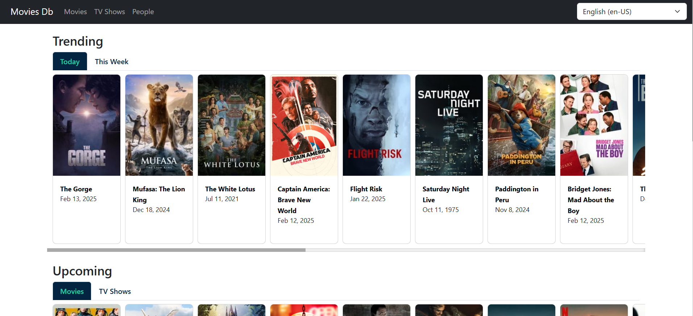

### Movies

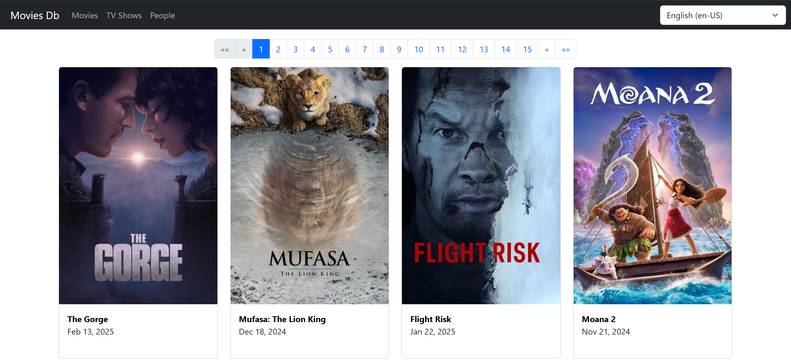

### Movie details

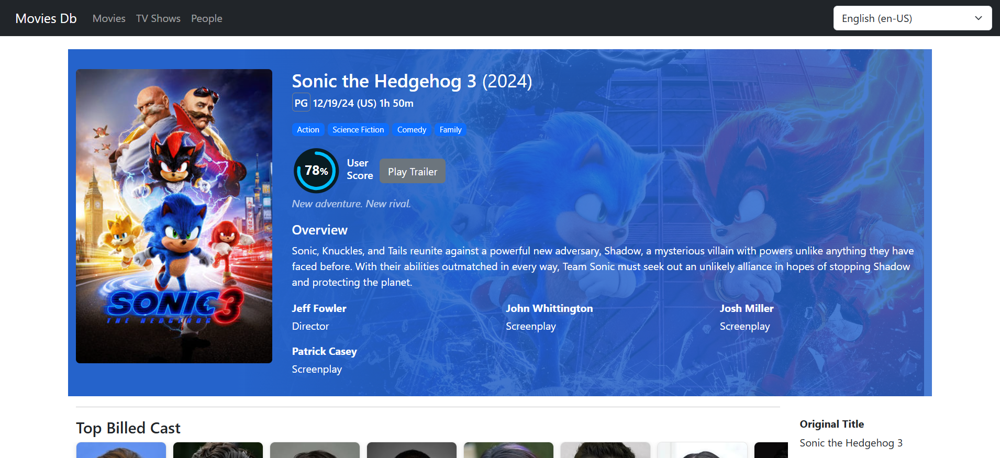

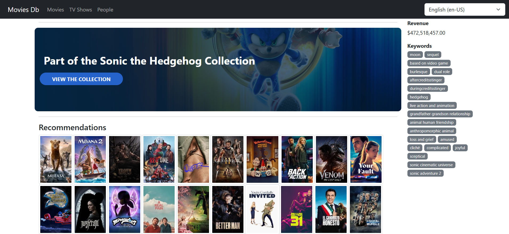

### Movies collection

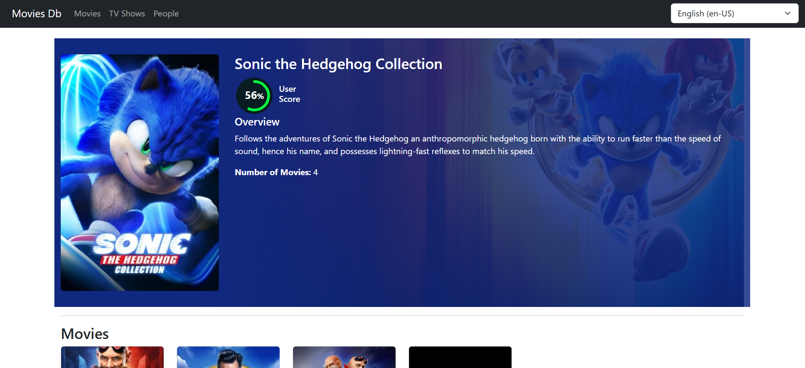

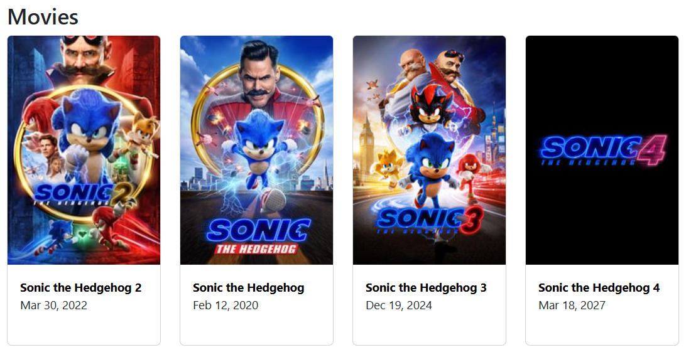

### TV Series details

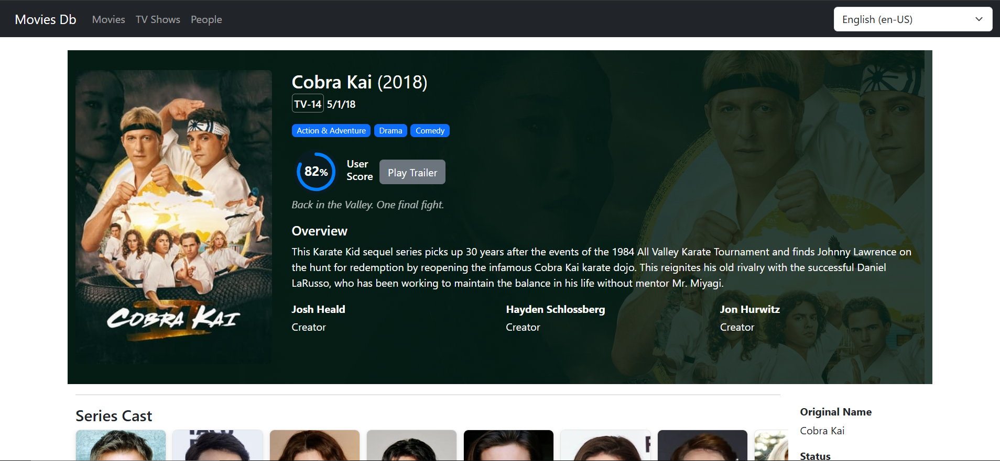

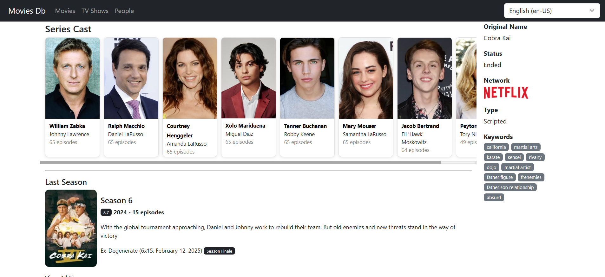

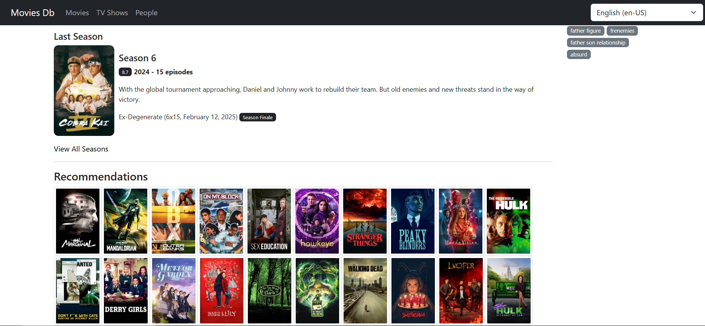

### People

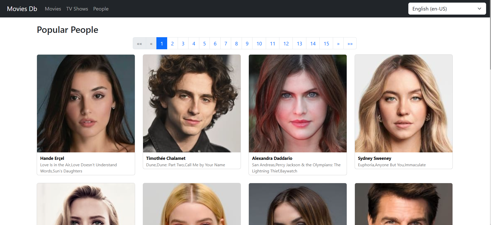

### Person details

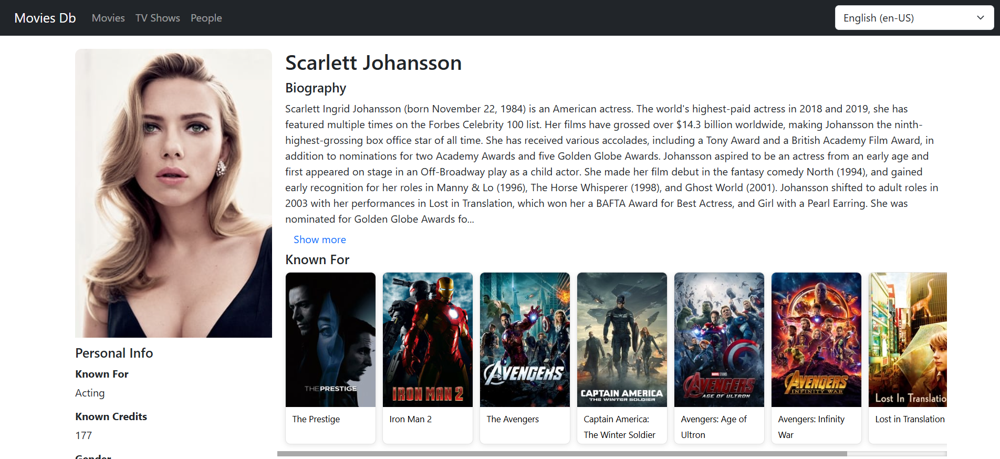

## Contributing
Contributions are welcome! If you find any issues or have suggestions for improvements, please feel free to open an issue or submit a pull request.

## License
This project is licensed under the MIT License - see the [LICENSE](https://github.com/cristofima/MoviesDb/blob/master/LICENSE) file for details.

## Acknowledgements
- [The Movie Database (TMDb)](https://developer.themoviedb.org/) for providing the API used in this project
- [Bootstrap](https://getbootstrap.com/) for the responsive styling of the application
